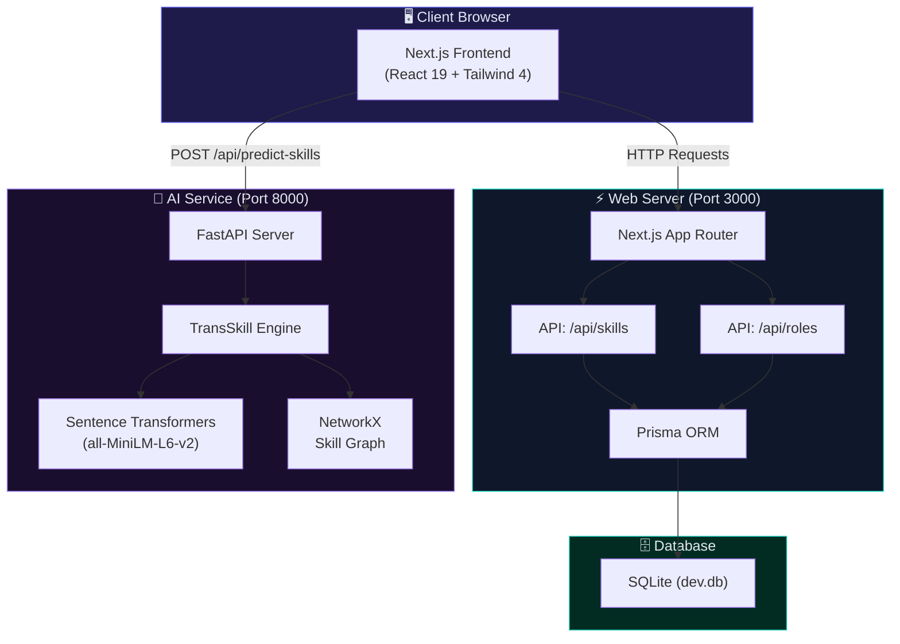
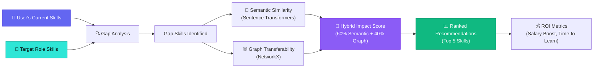
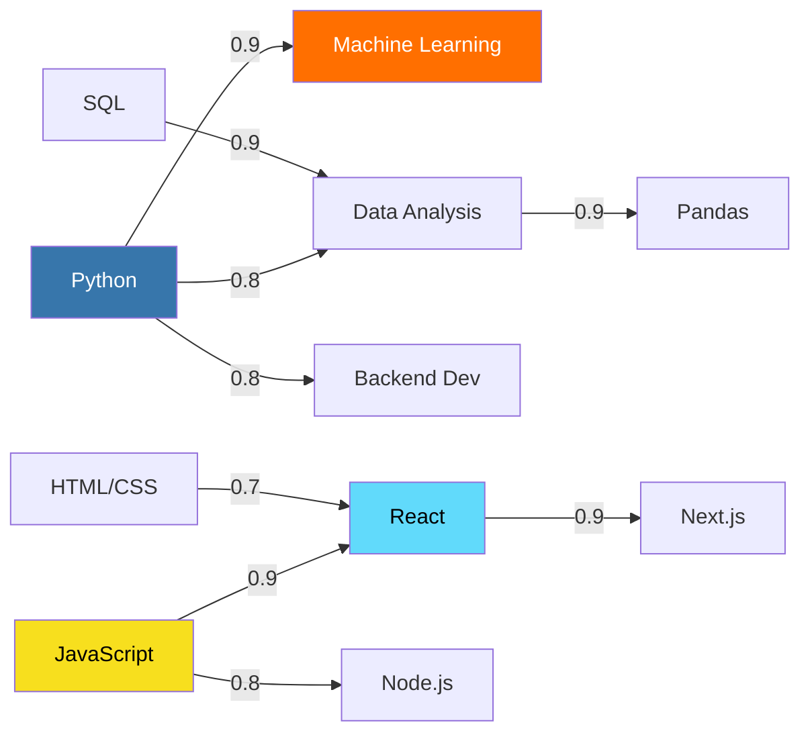
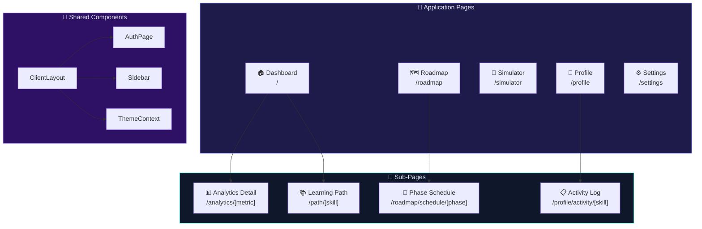
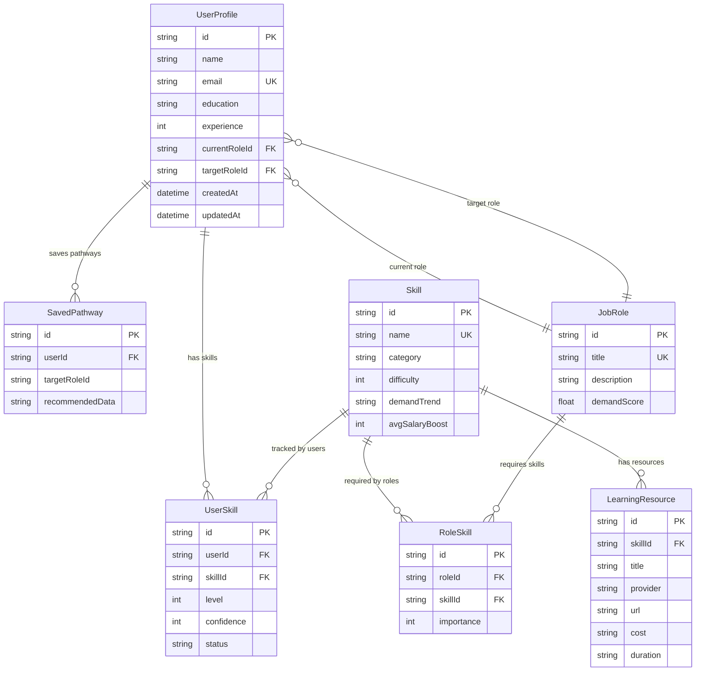
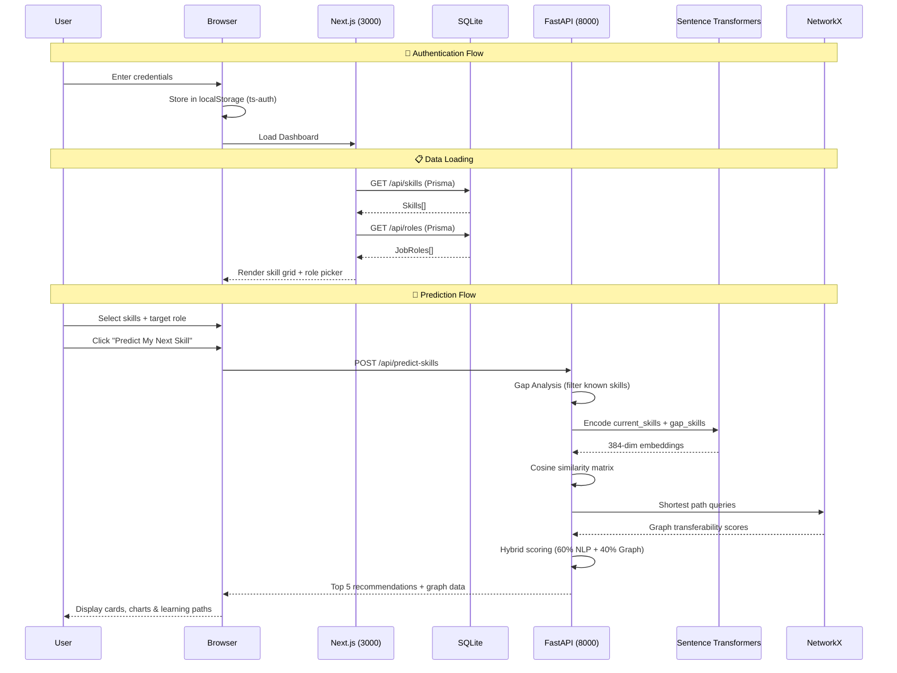

<p align="center">
  
</p>

<h1 align="center">🧠 TransSkill AI — Career ROI Maximizer</h1>

<p align="center">
  <strong>Enterprise-grade AI platform that predicts skill transferability and maximizes your career ROI</strong>
</p>

<p align="center">
  
  
  
  
  
  
  
</p>

---

## 📖 Table of Contents

- [Overview](#-overview)
- [System Architecture](#-system-architecture)
- [Tech Stack](#-tech-stack)
- [Project Structure](#-project-structure)
- [Core Services](#-core-services)
  - [AI Prediction Engine](#1-ai-prediction-engine-ai-service)
  - [Web Application](#2-web-application-web)
- [Features & Pages](#-features--pages)
- [Database Schema](#-database-schema)
- [API Reference](#-api-reference)
- [Data Flow](#-data-flow)
- [Getting Started](#-getting-started)
- [Environment Variables](#-environment-variables)
- [Screenshots](#-screenshots)
- [Roadmap](#-roadmap)
- [Contributing](#-contributing)
- [License](#-license)

---

## 🌟 Overview

**TransSkill AI** is an AI-powered career intelligence platform that helps professionals identify the most impactful skills to learn next. It uses **Sentence Transformers** for semantic similarity analysis and **NetworkX graph algorithms** to map transferability pathways between skills, then scores and ranks recommendations based on a hybrid impact model.

### Key Value Propositions

| Feature | Description |
|---------|-------------|
| 🎯 **Skill Gap Analysis** | Compares your current skills against target role requirements |
| 🤖 **AI-Powered Predictions** | Uses NLP embeddings + graph algorithms for smart recommendations |
| 📊 **Impact Scoring** | Ranks skills by ROI (salary boost, time-to-learn, transferability) |
| 🗺️ **90-Day Roadmaps** | Generates phased learning plans with weekly schedules |
| 💬 **AI Career Mentor** | Built-in chatbot with 40+ knowledge domains for career guidance |
| 📈 **Analytics Dashboard** | Track skills, hours, readiness scores with interactive charts |

---

## 🏗️ System Architecture



---

## 🔧 Tech Stack

### Frontend (`/web`)

| Technology | Version | Purpose |
|------------|---------|---------|
| **Next.js** | 16.1.6 | React framework with App Router, SSR, API routes |
| **React** | 19.2.3 | Component-based UI library |
| **Tailwind CSS** | 4.0 | Utility-first CSS framework |
| **Framer Motion** | 12.34.3 | Animations, micro-interactions, page transitions |
| **Recharts** | 3.7.0 | Data visualization (Bar, Pie, Radar, Line, Area charts) |
| **Lucide React** | 0.575.0 | Icon library |
| **Prisma** | 5.22.0 | Database ORM for TypeScript |
| **TypeScript** | 5.x | Type-safe development |

### Backend / AI Service (`/ai-service`)

| Technology | Purpose |
|------------|---------|
| **FastAPI** | High-performance async Python API framework |
| **Uvicorn** | ASGI server for FastAPI |
| **Sentence Transformers** | NLP embeddings (all-MiniLM-L6-v2 model) |
| **NetworkX** | Graph-based skill transferability mapping |
| **Scikit-learn** | Cosine similarity computation |
| **Pydantic** | Request/response validation |

---

## 📂 Project Structure

```
TransSkill AI/
├── 📄 README.md                          # This file
├── 📄 LICENSE                            # MIT License
│
├── 🧠 ai-service/                       # Python AI Prediction Engine
│   ├── main.py                           # FastAPI server & API endpoints
│   ├── engine.py                         # TransSkill prediction engine core
│   ├── requirements.txt                  # Python dependencies
│   └── venv/                             # Python virtual environment
│
└── ⚡ web/                               # Next.js Web Application
    ├── prisma/
    │   ├── schema.prisma                 # Database schema (6 models)
    │   ├── seed.ts                       # Initial data seeding
    │   └── dev.db                        # SQLite database file
    │
    ├── src/
    │   ├── app/
    │   │   ├── layout.tsx                # Root layout (fonts, metadata)
    │   │   ├── page.tsx                  # Dashboard (prediction + chatbot)
    │   │   ├── globals.css               # Global styles, themes, animations
    │   │   │
    │   │   ├── analytics/
    │   │   │   └── [metric]/page.tsx     # Dynamic analytics detail pages
    │   │   │
    │   │   ├── path/
    │   │   │   └── [skill]/page.tsx      # Learning pathway for a skill
    │   │   │
    │   │   ├── roadmap/
    │   │   │   ├── page.tsx              # 90-day transition roadmap
    │   │   │   └── schedule/
    │   │   │       └── [phase]/page.tsx  # Phase schedule breakdown
    │   │   │
    │   │   ├── simulator/
    │   │   │   └── page.tsx              # Career simulator
    │   │   │
    │   │   ├── profile/
    │   │   │   ├── page.tsx              # User profile & skills
    │   │   │   └── activity/
    │   │   │       └── [skill]/page.tsx  # Skill activity log
    │   │   │
    │   │   ├── settings/
    │   │   │   └── page.tsx              # Theme, accent, account settings
    │   │   │
    │   │   └── api/
    │   │       ├── skills/route.ts       # GET /api/skills
    │   │       └── roles/route.ts        # GET /api/roles
    │   │
    │   ├── components/
    │   │   ├── AuthPage.tsx              # Login/Signup authentication page
    │   │   ├── ClientLayout.tsx          # Client wrapper (auth guard + theme)
    │   │   └── Sidebar.tsx               # Navigation sidebar
    │   │
    │   └── context/
    │       └── ThemeContext.tsx           # Global state (auth, theme, user)
    │
    ├── package.json
    ├── tsconfig.json
    └── .env                              # Database URL
```

---

## ⚙️ Core Services

### 1. AI Prediction Engine (`/ai-service`)

The prediction engine is the brain of TransSkill AI. It uses a **hybrid scoring model** combining NLP semantic similarity with graph-based skill transferability.



#### How the Engine Works

**Step 1 — Gap Analysis:**
```python
gap_skills = [s for s in target_role_skills if s not in current_skills]
```
Finds skills required by the target role that the user doesn't already possess.

**Step 2 — Semantic Similarity (NLP):**
```python
model = SentenceTransformer('all-MiniLM-L6-v2')
similarities = cosine_similarity(gap_embeddings, current_embeddings)
```
Embeds all skill names into 384-dimensional vectors and computes cosine similarity to find which gap skills are most semantically related to what you already know.

**Step 3 — Graph Transferability:**
```python
skill_graph = nx.Graph()
path_len = nx.shortest_path_length(graph, source=current_skill, target=gap_skill)
graph_score = 1.0 / (1.0 + path_len)
```
Uses a weighted graph of known skill relationships to calculate direct transferability paths.

**Step 4 — Hybrid Scoring:**
```python
impact_score = (semantic_similarity * 0.6) + (graph_score * 0.4)
```
Combines both signals into a final 0-10 impact score. Higher scores mean the skill is easier to learn given your background AND has strong transferability pathways.

**Step 5 — ROI Estimation:**
- **Time to ROI**: Inversely proportional to impact score (higher impact → faster learning).
- **Salary Impact**: `impact_score × $1,500` estimated annual boost.

#### Skill Graph Visualization



---

### 2. Web Application (`/web`)

The Next.js frontend provides a premium, responsive interface with glassmorphism design, micro-animations, and section-specific themed backgrounds.



---

## 🚀 Features & Pages

### 🏠 Dashboard (`/`)
The main command center featuring:
- **Skill Selection Grid** — Select your current skills from the database
- **Confidence Sliders** — Rate your proficiency per skill (0-100%)
- **Target Role Picker** — Choose your career target
- **AI Prediction Engine** — One-click skill recommendations with ROI metrics
- **Learning Path Cards** — Clickable pathways with resources and duration
- **Analytics Overview** — 4 stat cards + 4 interactive charts:
  - Skill Distribution (Donut Chart)
  - Weekly Activity (Line Chart)
  - Career Readiness (SVG Gauge)
  - Skill Proficiency (Radar Chart)
- **AI Career Mentor Chatbot** — 40+ knowledge topics, contextual suggestions

### 📊 Analytics Detail (`/analytics/[metric]`)
Eight dedicated landing pages for deep metric analysis:

| Metric | Route | Key Visualizations |
|--------|-------|-------------------|
| Skills Tracked | `/analytics/skills-tracked` | Monthly trend, skill breakdown pie |
| Hours Logged | `/analytics/hours-logged` | Daily bars, streak tracking |
| Readiness Score | `/analytics/readiness-score` | Radar chart, score breakdown |
| Career Matches | `/analytics/career-matches` | Match distribution, salary trends |
| Skill Distribution | `/analytics/skill-distribution` | Category donut, domain analysis |
| Weekly Activity | `/analytics/weekly-activity` | Daily patterns, target comparison |
| Career Readiness | `/analytics/career-readiness` | Multi-dimension radar, tips |
| Skill Proficiency | `/analytics/skill-proficiency` | Skills vs target overlay radar |

Each page includes: Hero header, 4 insight cards, trend chart, breakdown chart, and actionable recommendations.

### 🗺️ My Roadmap (`/roadmap`)
- **90-Day Transition Plan** split into 3 phases (Foundation → Application → Mastery)
- **Phase Schedules** (`/roadmap/schedule/[phase]`) with weekly breakdowns
- Progress tracking with mark-complete functionality
- Resource links for each learning block

### 🧭 Career Simulator (`/simulator`)
- Compare multiple career paths side-by-side
- Salary projections and growth trajectories
- Skill overlap analysis between current and target roles
- Market demand indicators

### 👤 Profile (`/profile`)
- Personal information management (name, email, role)
- Current skills inventory with proficiency levels
- Skill activity logs (`/profile/activity/[skill]`) with session history
- Profile picture upload support

### ⚙️ Settings (`/settings`)
- **Theme Toggle** — Light / Dark mode
- **Accent Color Picker** — Indigo, Purple, Emerald, Rose, Amber
- **Account Management** — Password change, email update
- **Sign Out** — Clears session and redirects to auth page

### 💬 AI Career Mentor (Chatbot)
Built into the Dashboard with a floating action button:
- **40+ Knowledge Domains** including salaries, languages, frameworks, career paths, interviews, certifications, freelancing, motivation, and more
- **Contextual Suggestions** — Auto-suggests related topics after each response
- **Smart Matching** — Scores keyword matches by specificity (longer = better match)

---

## 🗄️ Database Schema



---

## 📡 API Reference

### Web API Routes (Next.js — Port 3000)

| Method | Endpoint | Description | Response |
|--------|----------|-------------|----------|
| `GET` | `/api/skills` | Fetch all skills from database | `{ skills: Skill[] }` |
| `GET` | `/api/roles` | Fetch all job roles from database | `{ roles: JobRole[] }` |

### AI Service API (FastAPI — Port 8000)

| Method | Endpoint | Description |
|--------|----------|-------------|
| `GET` | `/` | Health check |
| `POST` | `/api/predict-skills` | Run skill prediction engine |

#### `POST /api/predict-skills`

**Request Body:**
```json
{
  "current_skills": ["JavaScript", "React", "HTML/CSS"],
  "target_role": "Full Stack Developer",
  "target_role_skills": ["JavaScript", "TypeScript", "React", "Node.js", "SQL", "Git"]
}
```

**Response:**
```json
{
  "recommendations": [
    {
      "skill": "Node.js",
      "impact_score": 7.2,
      "transfer_score": 5.5,
      "reason": "Highly transferable from your existing knowledge of JavaScript.",
      "transfer_from": "JavaScript",
      "time_to_roi": "5 to 7 weeks",
      "salary_impact": 10800,
      "learning_resources": [
        {
          "title": "Node.js Masterclass",
          "provider": "Coursera",
          "duration": "5 weeks",
          "url": "#"
        }
      ]
    }
  ],
  "visual_graph_data": {
    "nodes": [
      { "id": "JavaScript", "group": 1, "label": "JavaScript" },
      { "id": "Node.js", "group": 2, "label": "Node.js" }
    ],
    "links": [
      { "source": "JavaScript", "target": "Node.js", "value": 7.2 }
    ]
  }
}
```

---

## 🔄 Data Flow



---

## 🚀 Getting Started

### Prerequisites

- **Node.js** ≥ 18.x
- **Python** ≥ 3.10
- **npm** or **yarn**
- **Git**

### 1. Clone the Repository

```bash
git clone https://github.com/ShashwatSingh-Stud/Transskill-AI.git
cd Transskill-AI
```

### 2. Set Up the Web Application

```bash
cd web

# Install dependencies
npm install

# Set up the database
npx prisma generate
npx prisma db push
npx prisma db seed

# Start the development server
npm run dev -- -p 3000
```

The web app will be available at `http://localhost:3000`

### 3. Set Up the AI Service

```bash
cd ai-service

# Create virtual environment
python -m venv venv

# Activate it
# Windows:
.\venv\Scripts\activate
# macOS/Linux:
source venv/bin/activate

# Install dependencies
pip install -r requirements.txt

# Start the AI server
python -m uvicorn main:app --reload --port 8000
```

The AI service will be available at `http://localhost:8000`

> **Note:** The first launch will download the `all-MiniLM-L6-v2` model (~80MB). Subsequent launches use the cached model.

### 4. Verify Both Services

| Service | URL | Expected Response |
|---------|-----|-------------------|
| Web App | `http://localhost:3000` | Login/Signup page |
| AI Health | `http://localhost:8000` | `{"status": "ok", "message": "TransSkill AI Service Running"}` |

---

## 🌍 Environment Variables

### Web (`web/.env`)

```env
DATABASE_URL="file:dev.db"
```

### AI Service

No environment variables required for the MVP. The service runs with defaults.

---

## 🎨 Design System

### Section-Specific Backgrounds

Each page has a unique, immersive background inspired by premium design references:

| Section | Theme | Light Mode | Dark Mode |
|---------|-------|-----------|----------|
| Dashboard | Cybernetic HUD | SVG dot grid + indigo radials | Cyan/crimson glow grid |
| Simulator | V-Beam Light | Top-down violet bloom | Concentrated purple beam |
| Roadmap | Teal Grunge | SVG fractal noise + emerald | Deep emerald textured |
| Profile | Midnight Blue | Smooth sky gradient | Dark navy with grain |
| Settings | Vivid Mesh | Rose/amber/violet blend | Multi-color neon mesh |

### UI Features

- **Glassmorphism** — Frosted glass panels with backdrop blur
- **Micro-Animations** — Hover scale, tap feedback, staggered entry
- **Neon Glow Buttons** — Animated gradient border effects
- **Stat Card Hover Glow** — Radial gradient overlay on hover
- **Dark Mode** — Full dark theme with adjusted contrast ratios

---

## 🗺️ Roadmap

- [x] Core prediction engine (Sentence Transformers + NetworkX)
- [x] Dashboard with skill selection and predictions
- [x] AI Career Mentor chatbot (40+ domains)
- [x] Analytics dashboard with interactive charts
- [x] 90-day transition roadmaps with phase schedules
- [x] Career simulator
- [x] User profile and activity tracking
- [x] Settings with theme customization
- [x] Auth system (login/signup/signout)
- [x] Section-specific premium backgrounds
- [x] Analytics detail pages (8 metrics)
- [ ] Supabase/PostgreSQL migration for production
- [ ] Real job market data integration (LinkedIn API)
- [ ] Collaborative learning rooms
- [ ] AI-powered resume builder
- [ ] Mobile responsive PWA
- [ ] Deployment to Vercel + Railway

---

## 🤝 Contributing

Contributions are welcome! Here's how to get started:

1. **Fork** the repository
2. **Create** a feature branch (`git checkout -b feature/amazing-feature`)
3. **Commit** your changes (`git commit -m 'feat: add amazing feature'`)
4. **Push** to the branch (`git push origin feature/amazing-feature`)
5. **Open** a Pull Request

### Development Guidelines

- Follow the existing code style and component patterns
- Use TypeScript for all frontend code
- Add proper error handling for API calls
- Test both light and dark mode for UI changes
- Ensure the build passes (`npm run build`) before submitting

---

## 📄 License

This project is licensed under the **MIT License** — see the [LICENSE](LICENSE) file for details.

---

<p align="center">
  <strong>Built with ❤️ by TransSkill AI Team</strong>
</p>

<p align="center">
  <a href="https://github.com/ShashwatSingh-Stud/Transskill-AI">⭐ Star this repo</a> •
  <a href="https://github.com/ShashwatSingh-Stud/Transskill-AI/issues">🐛 Report Bug</a> •
  <a href="https://github.com/ShashwatSingh-Stud/Transskill-AI/issues">✨ Request Feature</a>
</p>
